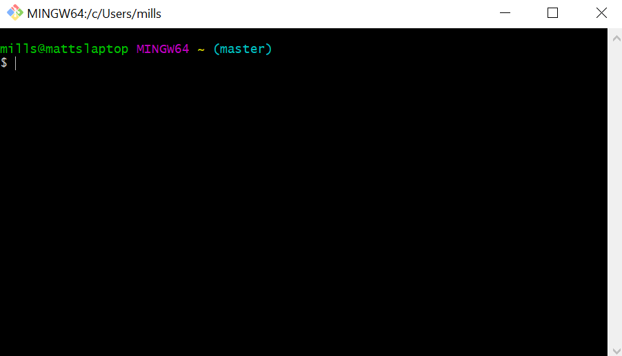
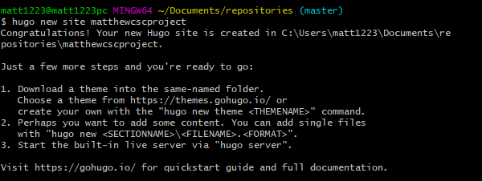
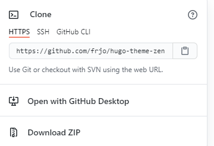
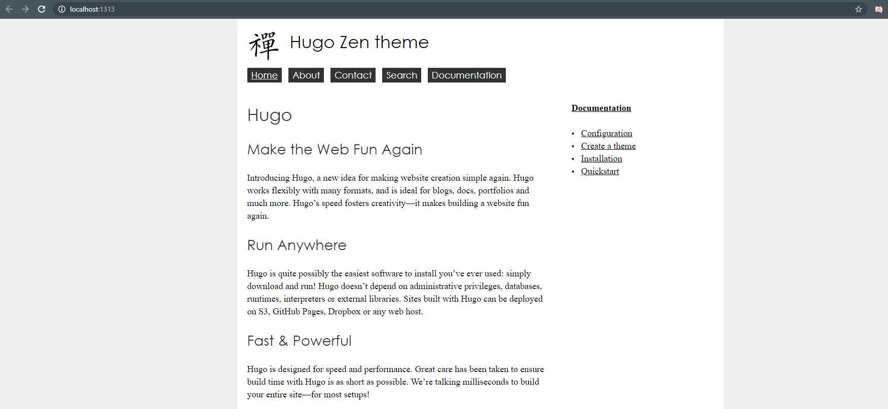

## How to create a new website with hugo

First thing you will need to do is open a terminal of some kind, for my examples i will be using `git bash`. 

Here is what it should look like if you are using git bash:


## Getting Started
Once you have your terminal of choice open you will also need to make sure you have `hugo` installed if you dont visit [https://gohugo.io/](https://gohugo.io/)

Once you have both a terminal and hugo installed we can begin with creating a new hugo website. first start off by finding a good location to store your website. i have chosen a folder within my documents that i created to store all of my repositories. to start you need to get your terminal into the desired place where you would like to keep your website. 


Once you have gotten yourself into that location we can start with the actual creating of the webiste, be sure to be thinking of a name that you would like to call your website. we will run the following code in order to use hugo to create the website.

```{sh}
hugo new --kind article projects/<my-project>
```

This should produce the following output in your terminal:


Once you have your website made you will need to get your terminal into the file you just created. 


Now that we have the basic structure of a website we should upload it to a github reposiory. lets create a new one by running the following code:


Now lets add it to an empty git repository that i have already created.


At this point you have created a new website using hugo, and added your base outline to a new git repository. In my next part i will show how to get a theme into your newly created hugo website.

## Adding A Theme
First you will need to find a theme that is to your liking, you can find some themes from [https://themes.gohugo.io/] (https://themes.gohugo.io/) I chose to go with the theme [https://themes.gohugo.io/hugo-theme-zen/] (https://themes.gohugo.io/hugo-theme-zen/) and is what i will be using to show as my example.
 
Before we can bring the theme into your website we must navigate our terminal into the `themes` folder within your websites files.


Now that we have put ourselves into the `themes` folder we can now begin to bring in the theme you have selected from github. Once you select the theme that you would like to use you need to copy the repository link that is provided. 


This is the part that can cause issues so be very careful on the next step. we will now clone the theme that you have selected into our website. we are going to be cloning the theme but as a sub-module.


Now to make sure that we havent messed anything up lets backup to the main folder for your website and make sure everything is still there.


At this point you have added a theme to your website. the folder that is now in your `themes` folder should look something along the lines of this:

 
 Most themes come with a example site that you can use to make sure the theme was installed right. in the next part i will show you how to setup the example site.

## Example Site

At this point we have setup a new hugo website, created a git repoitory, and added a theme to your website. now we will go through the steps of setting up the provided example website provided by the theme. 

To start off we need to get our terminal into the example site folder within your theme.


Now that we are in the example site folder we can now take those files and bring them into your website files by copying them. 


now we have copied the files that are within the example site folder and placed them in their coresponding folder within your website. this is done by telling the terminal to place them in the directory that is 3 behind the current one which is represented by `../../..` which just so happens to be your main directory for your website.

just to make sure we havent messed anything up and everything is where it should be lets go back to our main website folder and check.


Now all that is left to do is get hugo to serve up the website and see if you did everything correctly. 
 

 this should produce a website at the following adress [http://localhost:1313/] (http://localhost:1313/) and should look something along the lines of this if you are using the zen theme like me:
 
