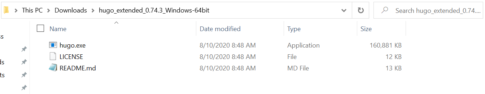
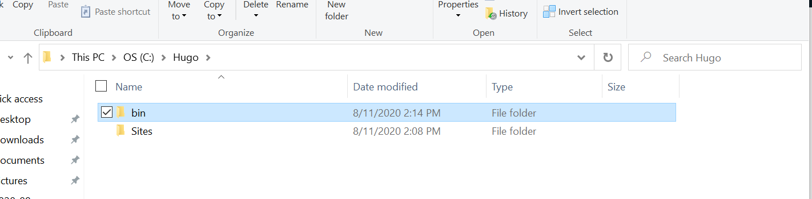
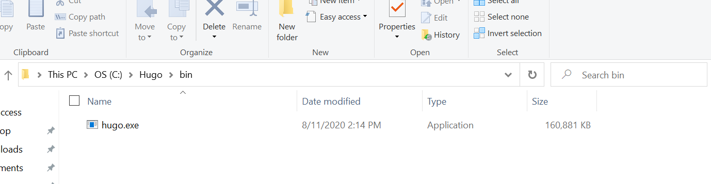
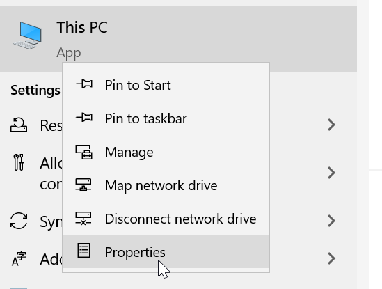
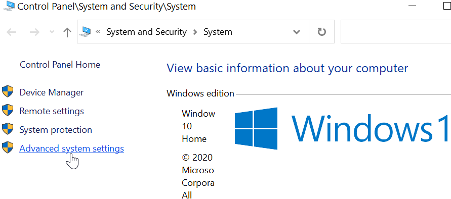
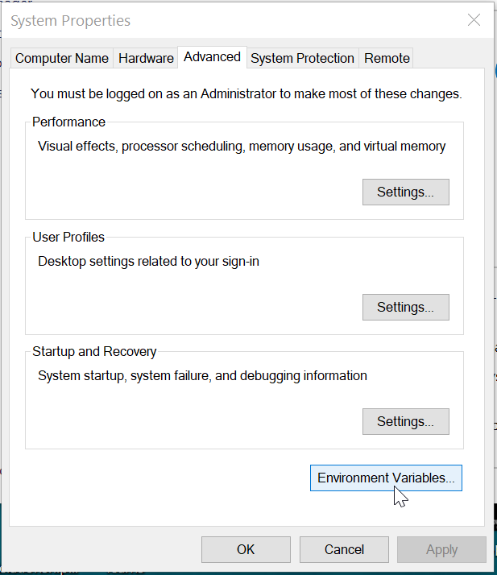
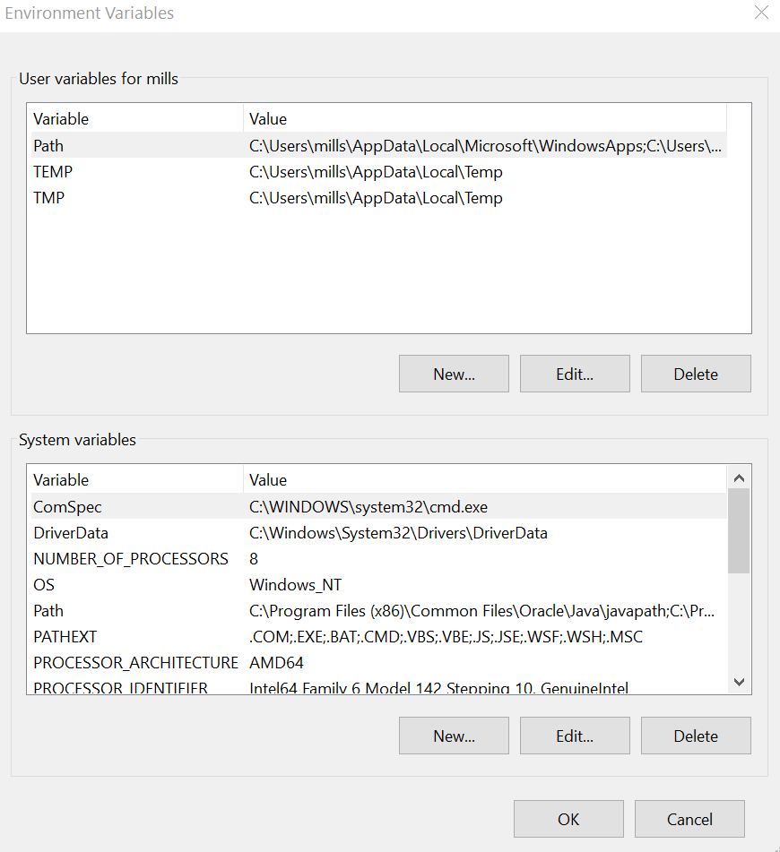
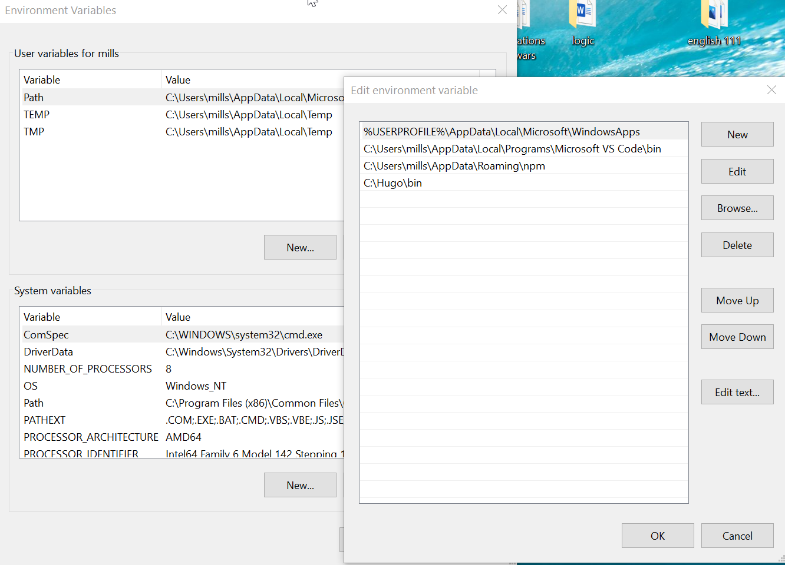
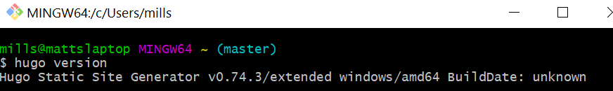

## Hugo

This article will be about my struggles with getting hugo going.

At the begining of the semester we were tasked with installing the git bash terminal and installing the static site generator called hugo. while the directions on their website were very detailed and seemed like they had all of the issues identified and solved, this turned out to not be the case though. when it came to MacOs users the install seemed to go seemlessly. when it came to getting it to work on windows it seemed to be going seemlessly until we got to the end and tried to serve up a sample website.

when we tried to serve up the sample website we were met with an error that one we looked into was identified as appearing as `hugo` could not be found. this was puzzling and took some time to figure out how to get around this issue and to get hugo working on windows. the issue that we were running into was that `hugo` was not set to be in the system variables. this also wasnt the only issue we were running into as for som reason that still did not fix our issue. we then figured out that if we downloaded the executiable version of hugo we can place it in a location that we can add to our system variables so our terminals can pick it up.

first we downloaded the hugo files and extracted the data inside of the zipped file. here is what it looked like after we extracted the files:
 

After we got these files we could begin finding a good place to put them. we decided to go for a simple but important location for this folder once we created this folder we then add 2 folders within the folder you just created one of which you named `bin` and the other you name `sites` this is what it should look like once you have done this:
 

now that we have a nice place to put the hugo executiable that we downloaded at the start. navigate into the bin folder, once there we will copy the exe file that is in the folder we downloaded earlier, and paste it into the bin folder that you just created. it should look like this if done right:
 

since we now have a working version of hugo that we know the location of we can add it to windows system variables. first we need to type into our windows search bar `this pc` and right click on the this pc option should look like this.
 

Once you are into the properties you need to click on advanced properties on the left.
 

Now we are in the advanced system properties, click on the advanced tab if not already there. at the bottom of the advanced tab you will see enviormental variables. click on the enviormental variables this is where we will add the hugo file that we just placed into our main directory.
 

It is now time to add the .exe file to your system variables
 

click edit on the path variable in the top box. this is the paths that your system will look for when you are doing things in a terminal. add the file location of the hugo files you just put in the new bin folder.

once you get all of that done you should have hugo working in a terminal. you can make sure of this by running `hugo version` in any terminal this should produce something that looks like this:
 

 ## Article Dates

 another issue that i have run into is for any dates that you would like to change for example at the begining of this article, there is so easy way to change that date. we looked for about an hour and a half and have not found an easy way to change the date even trying to just say the desired date in the front matter.